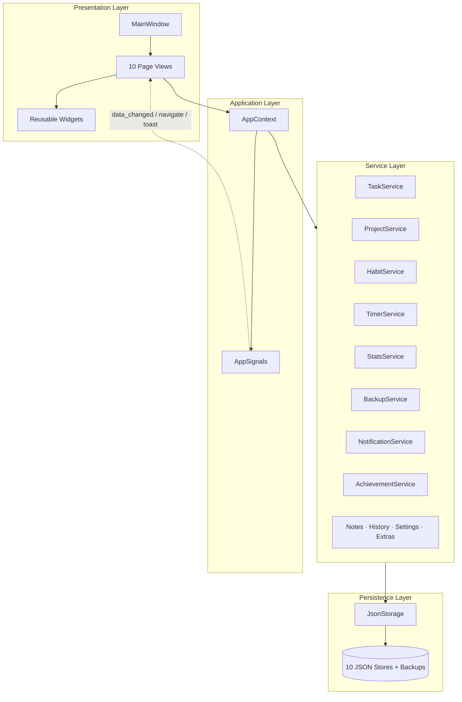

# FocusFlow — Personal Productivity OS

> A full-featured, offline-first desktop productivity application built from scratch in **Python** and **PySide6 (Qt)**.  
> Designed, architected, and implemented as a portfolio-grade engineering project — not a tutorial clone.

**Version:** 1.0.0  
**Platform:** Windows 10/11 (desktop-native)  
**Scale:** ~7,200+ lines of Python across 56 modules  
**Data:** 100% local JSON — no database server, no cloud, no accounts

---

## Table of Contents

1. [Executive Summary](#executive-summary)
2. [Why This Project](#why-this-project)
3. [Skills Demonstrated](#skills-demonstrated)
4. [Tech Stack](#tech-stack)
5. [Architecture](#architecture)
6. [Project Structure](#project-structure)
7. [Feature Modules](#feature-modules)
8. [Data & Persistence Layer](#data--persistence-layer)
9. [UI / UX Design](#ui--ux-design)
10. [Windows Desktop Integration](#windows-desktop-integration)
11. [Engineering Highlights](#engineering-highlights)
12. [Getting Started](#getting-started)
13. [Keyboard Shortcuts](#keyboard-shortcuts)
14. [Configuration & Data Files](#configuration--data-files)
15. [Design Decisions & Trade-offs](#design-decisions--trade-offs)
16. [Future Roadmap](#future-roadmap)
17. [License](#license)

---

## Executive Summary

**FocusFlow** is a personal productivity operating system — a single desktop app that replaces a stack of separate tools (task managers, habit trackers, Pomodoro timers, notes apps, and analytics dashboards).

It combines:

- **Task & project management** with priorities, estimates, deadlines, and Pomodoro integration  
- **Habit tracking** with streaks, heatmaps, and daily wellness logging  
- **Focus timers** (Pomodoro) linked directly to tasks with budget tracking  
- **Notes, calendar, statistics, and audit history** in one cohesive UI  
- **Gamification** (XP, levels, badges) to encourage consistent use  
- **Enterprise-style reliability** for a solo app: atomic saves, backups, corruption recovery, and restore

The application is inspired by products like Notion, TickTick, Todoist, and Motion — but implemented entirely offline with a custom architecture and no third-party backend.

---

## Why This Project

Recruiters and hiring managers often see CRUD web apps or copy-paste tutorials. **FocusFlow is different:**

| Dimension | What FocusFlow demonstrates |
|-----------|----------------------------|
| **Scope** | End-to-end product: models, services, UI, persistence, OS integration |
| **Architecture** | Clean layered design with dependency injection via `AppContext` |
| **Desktop engineering** | Real Qt widgets, custom-painted controls, timers, notifications |
| **Data integrity** | Atomic JSON writes, backup/restore, corrupt-file recovery |
| **Product thinking** | Task estimates (days × daily hours), Pomodoro budgets, scoped UI refresh |
| **Polish** | Professional settings toggles, grouped navigation, Windows launcher |

This project shows the ability to **own a feature from domain model to pixel**, not just wire up a framework.

---

## Skills Demonstrated

### Languages & Frameworks
- **Python 3.13+** — dataclasses, typing, pathlib, logging, subprocess/OS integration  
- **PySide6 (Qt 6)** — signals/slots, custom widgets, stylesheets, main window architecture  
- **Matplotlib** — embedded analytics charts in a desktop UI  

### Software Engineering
- **Layered architecture** — Models → Services → UI  
- **Dependency injection** — single `AppContext` wires all services  
- **Event-driven UI** — `AppSignals` bus for cross-page refresh and navigation  
- **Domain modeling** — rich `Task` model with estimate math, status lifecycle, Pomodoro budgets  
- **Atomic persistence** — temp-file + rename pattern for crash-safe saves  
- **Backup & disaster recovery** — dated backups, restore with in-memory reload  
- **Scoped performance** — pages refresh only when visible and relevant  

### Desktop / Platform
- **Windows registry integration** — launch-on-startup via `HKCU\...\Run`  
- **Desktop notifications** — Plyer + PowerShell fallback with safe escaping  
- **Silent launchers** — `.pyw`, `.vbs`, Desktop shortcuts (no console window)  
- **Custom app icon** — programmatic `.ico` generation for taskbar branding  

### UI / UX
- Custom **AnimatedCheckBox** and **SettingToggle** with painted checkmarks  
- Glassmorphism cards, accent theming, grouped sidebar navigation  
- Confirmation dialogs, selection-safe task actions, toast feedback  

---

## Tech Stack

| Category | Technology |
|----------|------------|
| Language | Python 3.13+ |
| GUI | PySide6 (Qt 6) |
| Charts | Matplotlib |
| Notifications | Plyer (+ Windows PowerShell fallback) |
| Markdown | Python `markdown` library |
| Storage | Local JSON files (no SQL) |
| Platform | Windows 10/11 |

### Dependencies

```
PySide6>=6.6.0
matplotlib>=3.8.0
plyer>=2.1.0
markdown>=3.5.0
```

---

## Architecture

FocusFlow follows a **three-layer desktop architecture** with a central application context.



### Layer Responsibilities

| Layer | Location | Responsibility |
|-------|----------|----------------|
| **Models** | `src/models/` | Dataclasses, validation helpers, `to_dict()` / `from_dict()` serialization |
| **Services** | `src/services/` | Business logic, CRUD, timers, stats, backups, notifications |
| **UI Pages** | `src/ui/pages/` | Full-screen views (Dashboard, Tasks, Settings, etc.) |
| **Widgets** | `src/widgets/` | Reusable controls (task rows, dialogs, charts, toggles) |
| **Utils** | `src/utils/` | Theme, paths, config constants, logging |

### AppContext — Dependency Hub

All pages receive a single **`AppContext`** instance containing:

- Every service (tasks, projects, habits, timers, stats, …)  
- Shared **`AppSignals`** for decoupled UI updates  
- Cross-cutting helpers: `start_task_focus()`, `toggle_task_done()`, `reload_from_disk()`, `manual_save()`

This avoids global singletons and keeps the UI testable and maintainable.

### Signal Bus

```python
class AppSignals(QObject):
    data_changed = Signal(str)   # e.g. "tasks", "timers", "settings"
    navigate = Signal(str)       # page id — e.g. "pomodoro"
    toast = Signal(str)          # user feedback banner
```

Pages subscribe to `data_changed` but only **refresh when visible** and when the change kind is relevant — reducing unnecessary UI work.

---

## Project Structure

```
FocusFlow/
├── main.py                    # Application entry point
├── FocusFlow.pyw              # Windows double-click launcher (no console)
├── FocusFlow.vbs              # Silent shortcut launcher
├── FocusFlow.cmd              # Fallback batch launcher
├── requirements.txt
├── scripts/
│   ├── generate_icon.py       # Builds assets/icons/focusflow.ico
│   └── install_desktop_shortcut.ps1
├── assets/
│   ├── icons/                 # App icon
│   ├── fonts/                 # Optional bundled fonts
│   ├── images/
│   └── sounds/
├── data/                      # All user data (JSON + backups/)
│   ├── tasks.json
│   ├── projects.json
│   ├── habits.json
│   ├── notes.json
│   ├── timers.json
│   ├── stats.json
│   ├── history.json
│   ├── settings.json
│   ├── extras.json
│   ├── achievements.json
│   └── backups/
├── logs/
└── src/
    ├── models/                # Domain models (11 modules)
    ├── services/              # Business logic (14 modules)
    ├── ui/
    │   ├── main_window.py
    │   └── pages/             # 10 application pages
    ├── widgets/               # Reusable UI components
    └── utils/                 # Config, theme, paths, helpers
```

---

## Feature Modules

### 1. Dashboard
Central command center with:
- Personalized greeting and daily quote  
- Progress ring and completion metrics  
- Quick-add task entry  
- Active timer summary and streak display  
- Embedded charts for recent productivity  

### 2. Today's Tasks
Full task management workspace:
- **CRUD** — create, edit, delete, duplicate tasks  
- **Priorities** — low, medium, high, urgent  
- **Statuses** — not started, in progress, paused, completed, cancelled  
- **Rich estimates** — days / hours / minutes plus daily commitment (e.g. *7 days × 3 h/day ≈ 21 h total*)  
- **Search, filter, and sort**  
- Archive, favorite, tags, categories, project linking  
- **Selection-safe UI** — edit/delete require explicit selection with confirmation  
- Custom **AnimatedCheckBox** for reliable completion toggles  
- **Start Focus** — launches Pomodoro for the selected task  

### 3. Projects
- Color-coded projects with live **progress percentage**  
- Task counts synced from the task service  
- Project-scoped organization  

### 4. Habits & Daily Tracking
Unified wellness and habit hub (formerly split across multiple sections):
- Custom habits (daily / weekly / monthly cadence)  
- **Streak tracking** and completion rates  
- **Calendar heatmap** visualization  
- Daily wellness: mood slider, water intake, journal, prayer log  
- Activity trackers: workout, reading, coding, LeetCode, GitHub, study, finance  
- Scratch pad and XP/level display  

### 5. Calendar
- Month and week views  
- Task and deadline indicators on dates  
- Visual planning alongside the task list  

### 6. Pomodoro / Focus Timer
- Focus, short break, long break, and custom sessions  
- **Task-linked focus** — timer knows the active task and its time budget  
- Dual display: current slice remaining + total task budget remaining  
- Mark task done without stopping the timer  
- Desktop notifications on session completion  
- **Debounced persistence** — saves every 10 seconds while running (not every tick)  
- Buffered focus XP to avoid excessive disk writes  

### 7. Notes
- Markdown-based notes  
- Folders, pinning, auto-save  
- Offline note storage in JSON  

### 8. Statistics
- Daily, weekly, monthly, and yearly views  
- **Matplotlib** charts embedded in Qt  
- Productivity score (0–100) derived from activity metrics  

### 9. History
- Complete **audit log** of user actions  
- Entity type, timestamp, and human-readable summaries  
- Capped at 5,000 entries with rotation  

### 10. Settings
Professional grouped settings UI:
- **Appearance** — accent color swatch, font size  
- **Notifications** — desktop alerts, sounds, morning/evening reminders  
- **System** — Windows startup, auto backup, desktop shortcut creator  
- **Pomodoro** — focus/short/long durations, daily water goal  
- **Data & backup** — manual backup, restore picker, save now  
- Custom **SettingToggle** rows with painted checkmarks  

---

## Data & Persistence Layer

### JsonStorage — Crash-Safe Writes

Every save uses an **atomic write pattern**:

1. Serialize to a temporary file in the same directory  
2. Copy current file to `.bak` sibling  
3. Atomic replace via `Path.replace()`  

On read failure:
1. Attempt recovery from `.bak`  
2. Fall back to default factory if unrecoverable  
3. Log corruption events  

### Data Stores

| File | Contents |
|------|----------|
| `tasks.json` | All tasks with estimates, status, timers metadata |
| `projects.json` | Projects and progress counts |
| `habits.json` | Habit definitions and completion log |
| `notes.json` | Markdown notes and folders |
| `timers.json` | Active timer state and session history |
| `stats.json` | Aggregated productivity metrics |
| `history.json` | Audit trail |
| `settings.json` | User preferences and theme |
| `extras.json` | Wellness and daily activity logs |
| `achievements.json` | XP, level, unlocked badges |

### Backup & Restore

- **Automatic daily backups** to `data/backups/YYYY-MM-DD/`  
- **30-day retention** with automatic pruning  
- Manual backup before restore (`pre-restore` snapshot)  
- **`reload_from_disk()`** — hot-reloads all services after restore without restarting the app  

### History Service

Every meaningful action (task created, settings changed, backup restored, app closed) is logged for traceability and debugging.

---

## UI / UX Design

### Design Language
- **Dark theme** with teal accent (`#2DD4BF`) — configurable  
- Glassmorphism cards with subtle drop shadows  
- Grouped sidebar: **Overview · Work · Track · System**  
- Monogram nav badges (DB, TD, PR, …) instead of emoji icons  
- Active nav item: left accent strip + highlighted badge  

### Custom Widgets
| Widget | Purpose |
|--------|---------|
| `GlassCard` | Rounded container with glass-style background |
| `AnimatedCheckBox` | Custom-painted task completion checkmark |
| `SettingToggle` / `SettingRow` | Professional settings switches |
| `TaskRow` | Task list item with priority chips and selection state |
| `StatChip` | Compact metric display |
| `ProgressRing` | Circular progress on dashboard |
| `ChartWidget` | Matplotlib canvas wrapper |

### Theming
- Central `ThemeColors` dataclass and `build_stylesheet()` generator  
- Live theme updates when accent color or font size changes  
- Consistent Qt stylesheets across all controls  

---

## Windows Desktop Integration

FocusFlow behaves like a native Windows application:

| Feature | Implementation |
|---------|----------------|
| **Double-click launch** | `FocusFlow.pyw` + Desktop shortcut via `FocusFlow.vbs` |
| **No console window** | `pythonw.exe` launcher |
| **Taskbar icon** | `assets/icons/focusflow.ico` |
| **Launch on startup** | Registry key under `HKCU\Software\Microsoft\Windows\CurrentVersion\Run` |
| **Desktop notifications** | Plyer with PowerShell toast fallback |
| **Shortcut installer** | `scripts/install_desktop_shortcut.ps1` + Settings UI button |

### How to Launch (End User)

1. **Desktop shortcut** — double-click **FocusFlow** (recommended)  
2. **Project folder** — double-click `FocusFlow.pyw`  
3. **Developer mode** — `python main.py` from terminal  

> **Note:** When you update code in `src/`, you do **not** need to update the `.pyw` launcher — it always runs the latest `main.py` and source tree.

---

## Engineering Highlights

These details reflect production-minded thinking:

### Task Estimate Model
Tasks support multi-dimensional time planning:
- Duration: days + hours + minutes  
- Daily commitment: hours + minutes per day  
- Derived total: `estimate_days × daily_minutes + extras`  
- Pomodoro session length derived from daily budget or settings default  
- Remaining budget tracked during focus sessions  

### Timer Persistence Strategy
- UI ticks every second for smooth countdown  
- Disk writes batched every **10 seconds** while running  
- Focus XP awarded via buffered minute buckets  

### Scoped Page Refresh
`BasePage` only calls `refresh()` when:
- The page is currently visible  
- The `data_changed` kind matches `watch_kinds` or the page id  

This prevents unnecessary re-renders across 10 pages.

### Restore Without Restart
After backup restore, `AppContext.reload_from_disk()` rehydrates all service stores in memory and emits a global refresh — the user stays in the app.

### Notification Safety
PowerShell notification fallback uses explicit string escaping to prevent injection from user-generated task titles.

### Selection Safety (Tasks)
Edit and delete actions require an explicitly selected task — no silent fallback to the first list item.

---

## Getting Started

### Requirements
- Python **3.13+**  
- Windows **10/11**  

### Install

```bash
cd FocusFlow
python -m venv .venv
.venv\Scripts\activate
pip install -r requirements.txt
```

### Run (Development)

```bash
python main.py
```

### Run (Desktop — like a normal app)

```powershell
# Create Desktop + Start Menu shortcuts (one time)
powershell -ExecutionPolicy Bypass -File scripts\install_desktop_shortcut.ps1
```

Then double-click **FocusFlow** on your Desktop.

### Generate App Icon (optional)

```bash
python scripts/generate_icon.py
```

---

## Keyboard Shortcuts

| Shortcut | Action |
|----------|--------|
| `Ctrl+N` | New task |
| `Ctrl+F` | Focus task search |
| `Ctrl+S` | Manual save all stores |
| `Delete` | Delete selected task (on supported pages) |
| `Space` | Start / pause / resume timer (when not typing) |
| `Ctrl+1` … `Ctrl+9` | Jump to sidebar pages |

---

## Configuration & Data Files

Key constants live in `src/utils/config.py`:

| Constant | Default | Description |
|----------|---------|-------------|
| `DEFAULT_FOCUS_MINUTES` | 25 | Pomodoro focus length |
| `BACKUP_RETENTION_DAYS` | 30 | Max backup folders kept |
| `MAX_HISTORY_ENTRIES` | 5000 | Audit log cap |
| `XP_PER_TASK` | 25 | Gamification reward |
| `XP_PER_FOCUS_MINUTE` | 1 | Focus time reward |

User-editable settings persist in `data/settings.json`.

---

## Design Decisions & Trade-offs

| Decision | Rationale |
|----------|-----------|
| **JSON instead of SQLite** | Zero setup, human-readable, easy backup/restore, portfolio clarity |
| **No cloud sync** | Privacy-first, offline guarantee, simpler threat model |
| **Monolithic desktop app** | Appropriate for personal productivity; avoids distributed complexity |
| **Qt stylesheets over QML** | Faster iteration with Python-native UI code |
| **Custom widgets for checkmarks** | Qt native checkboxes were inconsistent on Windows dark theme |

### Known Limitations (honest scope)
- No automated test suite yet  
- No multi-device sync  
- Windows-first (startup/registry features are platform-specific)  
- Optional PyInstaller `.exe` packaging not included by default (Python install required)  

---

## Future Roadmap

Potential next steps for v2:

- [ ] PyInstaller / cx_Freeze standalone `.exe` (no Python install required)  
- [ ] Unit and integration tests (storage, task service, timer logic)  
- [ ] macOS and Linux launcher support  
- [ ] Drag-and-drop task reordering  
- [ ] Markdown preview pane for notes  
- [ ] Export/import (CSV, JSON bundle)  

---

## License

Private / portfolio use — all rights reserved.

---

## Contact

> **Replace this section with your details when sharing with recruiters.**

| | |
|---|---|
| **Author** | *[Your Name]* |
| **Email** | *[your.email@example.com]* |
| **LinkedIn** | *[linkedin.com/in/yourprofile]* |
| **GitHub** | *[github.com/yourusername]* |
| **Repository** | *[Link to this repo]* |

---

*FocusFlow — built to demonstrate full-stack desktop engineering: architecture, persistence, UI craft, and platform integration.*
